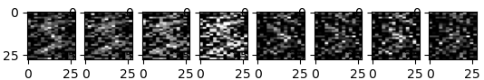

# Haar Scattering Transform in Python
A non-official implementation of "Unsupervised Deep Haar Scattering on Graphs, Chen X., Cheng X., Mallat S. 2014"


(Haar scattering transform of a handwritten digit 5)

## Data

Please download [MNIST](http://yann.lecun.com/exdb/mnist/) and 
[ECG5000](http://www.timeseriesclassification.com/description.php?Dataset=ECG5000) (we need only the two ".txt" files)
and paste the **files** directly inside ``./data/``.

[MNIST]: Y. LeCun, L. Bottou, Y. Bengio, and P. Haffner. "Gradient-based learning applied to document recognition." Proceedings of the IEEE, 86(11):2278-2324, November 1998

[ECG5000]: Yanping Chen, Yuan Hao, Thanawin Rakthanmanon, Jesin Zakaria, Bing Hu, and Eamonn Keogh. 2015. A general framework for never-ending learning from time series streams. <i>Data Min. Knowl. Discov.</i> 29, 6 (November  2015), 1622–1664. https://doi.org/10.1007/s10618-014-0388-4
**EXTRACTED FROM ORIGINAL DATA USED IN:**

Baim DS, Colucci WS, Monrad ES, Smith HS, Wright RF, Lanoue A, Gauthier DF, Ransil BJ, Grossman W, Braunwald E. Survival of patients with severe congestive heart failure treated with oral milrinone. J American College of Cardiology 1986 Mar; 7(3):661-670.


## Code overview

All code files are in ```./src/```.

Files with "utilities":
- ``haar_scattering_transform.py`` has an implementation of a class that ... computes the Haar Scattering Transform !
It is supposed to be clear from the docstrings, but in summary: we instantiate it with an ``igraph`` object representing
the structure of the domain where the signal lives (so that the pairings to pass from layer j to layer j+1 are computed
during initialization), and it has a method ``get_haar_scattering_transform`` that receives a (flattened) signal living
in that (graph) domain and computes its scalar or boolean Haar Scattering Transform, depending on the dtype of the input
(this is automatically detected).
- ``matching.py`` calls [blossalg](https://github.com/nenb/blossalg) methods that help us matching "nodes" in the Haar 
Scattering Transform. The package ``blossalg`` goal is to implement the Blossom Algorithm and it is still very young, 
but it works for this project. Install it at your own risk ! 
- ``unstructured2graphs.py`` has some utilities to build the domain graph for image grids and periodic time series, and 
to convert corresponding signals to the right format.
- ``read_MNIST.py`` reads the MNIST that we should be able to find under ``./data/``.
- ``read_ECG5000.py`` reads the ECG5000 data set we should be able to find under `./data/``.

Illustration files: all the files starting with ``example[...]``